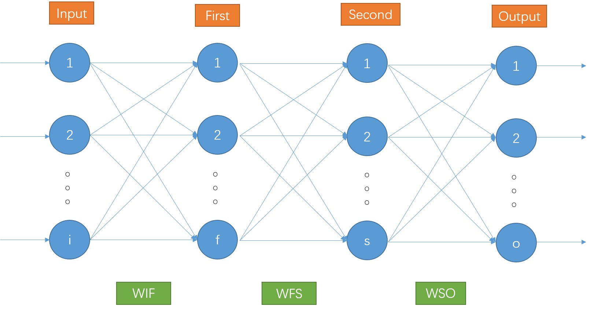
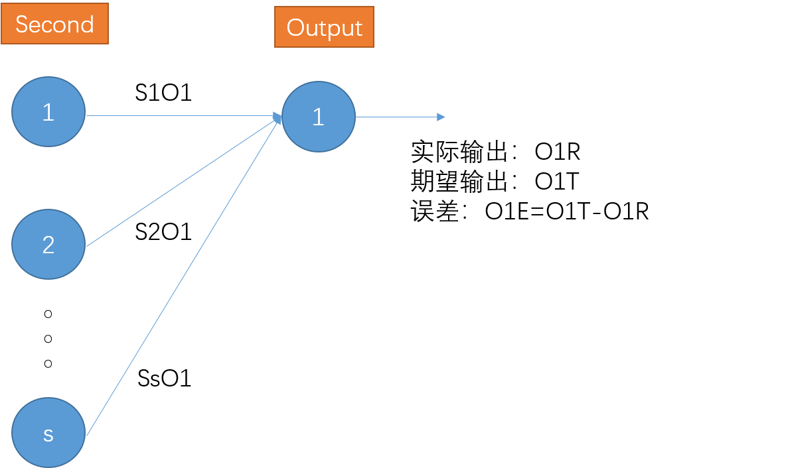
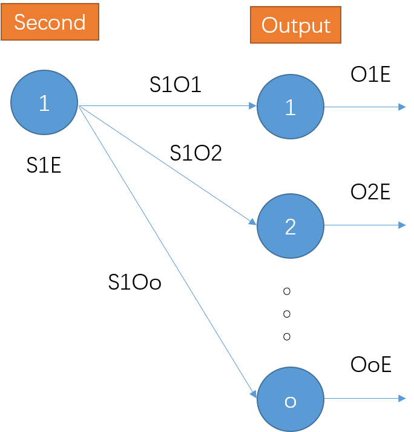
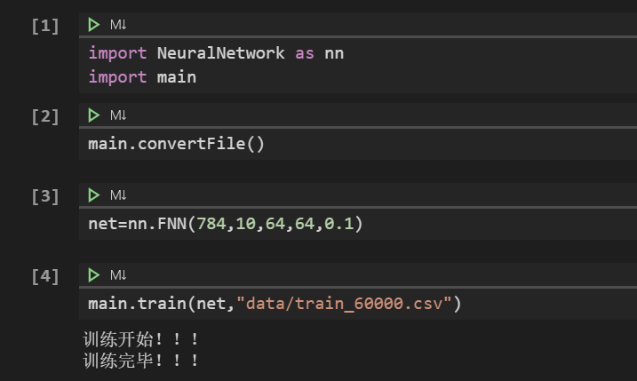
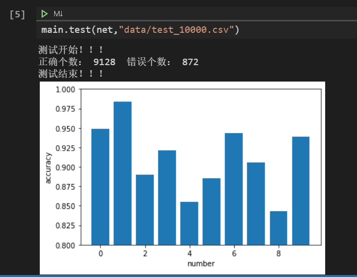
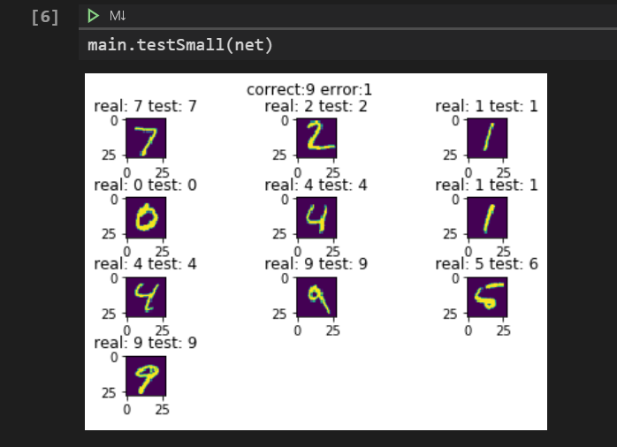

# 利用Python实现神经网络

## 一、设计背景

&emsp;&emsp;神经网络是一种模拟人脑的神经网络，以期能够实现类人工智能的机器学习技术。随着计算机计算速度的显著提升，如今的神经网络已经成为人工智能领域中最强大、最有用的方法之一。谷歌的DeepMind就是以神经网络为基础创造的阿尔法狗，其在围棋上击败了世界围棋大师李世石。
&emsp;&emsp;为深入理解神经网络背后的原理，我们小组决定利用Python语言及其一些常见的数学计算库（如Numpy），从零搭建一个神经网络，并利用MNIST数据集对该神经网络的效果进行测试。

## 二、设计目标

&emsp;&emsp;人工智能领域有一套非常流行的手写数字图片数据集MNIST，众多人工智能研究者都是用该数据集来测试他们的最新思想和算法，因此我们可以用该数据集来检测我们所构建的神经网络在图像识别领域的效果，并可以与其他研究者的成果进行比较。
&emsp;&emsp;在 http://yann.lecun.com/exdb/mnist 可以下载到MNIST数据集，该网站还记载了业界对该数据集进行识别的准确率，可以看到基于神经网络的图像识别技术的准确率通常在92%~98%，因此我们的目标准确率定于90%以上，争取不断缩小与行业标准的差距。

## 三、技术路线

1. 梳理出神经网络背后的数学原理，确定所要构建的神经网络的框架结构，并对其进行数学建模。

2. 利用Python语言及其常见的数学库实现神经网络的框架。

3. 创建神经网络模型，利用MNIST数据集对其进行训练和测试，根据测试结果对神经网络框架进行不断优化，使其对手写数字识别的准确率达到我们的预期效果。

4. 环境配置：ubuntu 18.04 LTS，python3.6.9

## 四、关键原理

1. 四层神经网络FNN框架

    

    * Input: 输入层，共有i个结点。

    * First: 第一隐藏层，共有f个结点。

    * Second: 第二隐藏层，共有s个结点。

    * Output: 输出层，共有o个结点。

    * WIF: 输入层与第一隐藏层之间的权重矩阵,f&times;i 。

    * WFS: 第一隐藏层与第二隐藏层之间的权重矩阵，s&times;f 。

    * WSO: 第二隐藏层与输出层之间的权重矩阵，o&times;s 。

    * func: 对神经网络每个结点应用的激活函数。对于标量$x$，$func(x)=\frac{1}{1+e^{-x}}$；对于矩阵$X$，$func(X)$对矩阵每个元素$x$应用$func(x)$。

    * k: 一个可供用户调节的参数，称为学习率。

2. 一些符号约定

    * $I_1,I_2,...,I_i$：表示Input层的第1个结点、第2个结点、...、第i个结点。

    * $F_1,F_2,...,F_f$：表示First层的第1个结点、第2个结点、...、第f个结点。

    * $S_1,S_2,...,S_s$：表示Second层的第1个结点、第2个结点、...、第s个结点。

    * $O_1,O_2,...,O_o$：表示Output层的第1个结点、第2个结点、...、第o个结点。

    * $I_1L,I_2L,...,I_iL$：表示Input层各结点的输入。

    * $I_1R,I_2R,...,I_iR$：表示Input层各结点的输出。

    * $F_1L,F_2L,...,F_fL$：表示First层各结点的输入。

    * $F_1R,F_2R,...,F_fR$：表示First层各结点的输出。

    * $S_1L,S_2L,...,S_sL$：表示Second层各结点的输入。

    * $S_1R,S_2R,...,S_sR$：表示Second层各结点的输出。

    * $O_1L,O_2L,...,O_oL$：表示Output层各结点的输入。

    * $O_1R,O_2R,...,O_oR$：表示Output层各结点的输出。

    * 矩阵IL：Input层的输入。

        $$
        IL=\begin{bmatrix}
        I_1L\\
        I_2L\\
        ...\\
        I_iL
        \end{bmatrix}
        $$

    * 矩阵IR：Input层的输出。

        $$
        IR=\begin{bmatrix}
        I_1R\\
        I_2R\\
        ...\\
        I_iR
        \end{bmatrix}
        $$

    * 矩阵FL：First层的输入。

        $$
        FL=\begin{bmatrix}
        F_1L\\
        F_2L\\
        ...\\
        F_fL
        \end{bmatrix}
        $$

    * 矩阵FR：First层的输出。

        $$
        FR=\begin{bmatrix}
        F_1R\\
        F_2R\\
        ...\\
        F_fR
        \end{bmatrix}
        $$
    
    * 矩阵SL：Second层的输入。

        $$
        SL=\begin{bmatrix}
        S_1L\\
        S_2L\\
        ...\\
        S_sL
        \end{bmatrix}
        $$
    
    * 矩阵SR：Second层的输出。

        $$
        SR=\begin{bmatrix}
        S_1R\\
        S_2R\\
        ...\\
        S_sR
        \end{bmatrix}
        $$
    
    * 矩阵OL：Output层的输入

        $$
        OL=\begin{bmatrix}
        O_1L\\
        O_2L\\
        ...\\
        O_oL
        \end{bmatrix}
        $$
    
    * 矩阵OR：Output层的输出

        $$
        OR=\begin{bmatrix}
        O_1R\\
        O_2R\\
        ...\\
        O_oR
        \end{bmatrix}
        $$
    
    * $I_xF_y$：表示$I_x$到$I_y$的权重。$(1\le x\le i,1\le y\le f)$

    * $F_xS_y$：表示$F_x$到$S_y$的权重。$(1\le x\le f,1\le y\le s)$
    
    * $S_xO_y$：表示$S_x$到$O_y$的权重。$(1\le x\le s,1\le y\le o)$
    
    * WIF：Input层与First层的权重矩阵。

        $$
        WIF=\begin{bmatrix}
        I_1F_1 & I_2F_1 &...& I_iF_1\\
        I_1F_2 & I_2F_2 &...& I_iF_2\\
        ... & ... &...& ...\\
        I_1F_f & I_2F_f &...& I_iF_f
        \end{bmatrix}
        $$
    
    * WFS：First层与Second层的权重矩阵。

        $$
        WFS=\begin{bmatrix}
        F_1S_1 & F_2S_1 &...& F_fS_1\\
        F_1S_2 & F_2S_2 &...& F_fS_2\\
        ... & ... &...& ...\\
        F_1S_s & F_2S_s &...& F_fS_s\\
        \end{bmatrix}
        $$
    
    * WSO: Second层和Output层的权重矩阵。

        $$
        WSO=\begin{bmatrix}
        S_1O_1 & S_2O_1 &...& S_sO_1\\
        S_1O_2 & S_2O_2 &...& S_sO_2\\
        ... & ... &...& ...\\
        S_1O_o & S_2O_o &...& S_sO_o\\
        \end{bmatrix}
        $$

    * 注意：设$A,B$为两个矩阵，则$A+B,A-B,A*B,A/B$表示矩阵A与矩阵B对应的元素相加、相减、相乘、相除；$A·B$表示矩阵A与矩阵B的点乘运算。
    
    * $O_1E,O_2E,...,O_oE$：表示Output层期望输出的数据$O_1T,O_2T,...,O_oT$与Output层实际输出的数据$O_1R,O_2R,...,O_oR$之差，即$O_1E=O_1T-O_1R,O_2E=O_1T-O_1R,...,O_oE=O_oT-O_oR$。

    * OE：Output层的误差矩阵。

        $$
        OE=\begin{bmatrix}
        O_1E\\
        O_2E\\
        ...\\
        O_oE
        \end{bmatrix}
        $$

    * 同理有Second层的误差矩阵SE：

        $$
        SE=\begin{bmatrix}
        S_1E\\
        S_2E\\
        ...\\
        S_sE
        \end{bmatrix}
        $$
    
    * 同理有First层的误差矩阵FE：

        $$
        FE=\begin{bmatrix}
        F_1E\\
        F_2E\\
        ...\\
        F_fE
        \end{bmatrix}
        $$

3. 神经网络的数学推导

    * $IR=IL$：
    
        $$
        \begin{aligned}
        I_1R&=I_1L\\
        I_2R&=I_2L\\
        &...\\
        I_iR&=I_iL\\
        \rhd \quad\\
        IR&=IL
        \end{aligned}
        $$

    * $FL=WIF·IR$：

        $$
        \begin{aligned}
        F_1L&=I_1R *I_1F_1+I_2R *I_2F_1+...+I_iR *I_iF_1\\
            &=\sum_{k=1}^i I_kR *I_kF_1\\
        F_2L&=I_1R *I_1F_2+I_2R *I_2F_2+...+I_iR *I_iF_2\\
            &=\sum_{k=1}^i I_kR *I_kF_2\\
        &...\\
        F_fL&=I_1R *I_1F_f+I_2R *I_2F_f+...+I_iR *I_iF_f\\
            &=\sum_{k=1}^i I_kR *I_kF_f\\
        \rhd \quad\\
        FL&=\begin{bmatrix}
        F_1L\\
        F_2L\\
        ...\\
        F_fL
        \end{bmatrix}\\
        \rhd \quad\\
        FL&=\begin{bmatrix}
        \sum_{k=1}^i I_kR *I_kF_1\\
        \sum_{k=1}^i I_kR *I_kF_2\\
        ...\\
        \sum_{k=1}^i I_kR *I_kF_f\\
        \end{bmatrix}\\
        \rhd \quad\\
        FL&=\begin{bmatrix}
        I_1F_1 & I_2F_1 &...& I_iF_1\\
        I_1F_2 & I_2F_2 &...& I_iF_2\\
        ... & ... &...& ...\\
        I_1F_f & I_2F_f &...& I_iF_f\\
        \end{bmatrix} · \begin{bmatrix}
        I_1R\\
        I_2R\\
        ...\\
        I_iR
        \end{bmatrix}\\
        \rhd \quad\\
        FL&=WIF · IR
        \end{aligned}
        $$
    
    * $FR=func(FL)$:

        $$
        \begin{aligned}
        F_1R&=func(F_1L)\\
        F_2R&=func(F_2L)\\
        ...\\
        F_fR&=func(F_fL)\\
        \rhd \quad\\
        FR&=func(FL)
        \end{aligned}
        $$
    
    * 同理可总结出神经网络的公式推导：

        $$
        \begin{aligned}
        IR&=IL\\
        FL&=WIF · OR\\
        FR&=func(FL)\\
        SL&=WFS · FR\\
        SR&=func(SL)\\
        OL&=WSO · SR\\
        OR&=func(OL)
        \end{aligned}
        $$

4. 神经网络的训练原理：误差的反向传播，调节权重矩阵。

    * 对误差进行建模：

        $$
        e=(t-o)^2
        $$

        1. e表示误差；

        2. t表示期望得到的输出；

        3. o表示实际得到的输出。
    
    * 反向传播的基本数学思想：梯度下降法。

        

        $$
        \begin{aligned}
        e_1&=(O_1T-O_1R)^2\\
        \rhd \quad\\
        \frac{\partial e_1}{\partial S_1O_1}&=2(O_1T-O_1R)\frac{\partial (O_1T-O_1R)}{\partial S_1O_1}\\
        &=-2(O_1T-O_1R)\frac{\partial O_1R}{\partial S_1O_1}\\
        &=-2(O_1T-O_1R)\frac{\partial func(O_1L)}{\partial S_1O_1}\\
        &=-2(O_1T-O_1R)\frac{\partial func(O_1L)}{\partial O_1L}\frac{\partial O_1L}{\partial S_1O_1}\\
        &=-2(O_1T-O_1R)func(O_1L)(1-func(O_1L))S_1R\\
        &=-2 \ast O_1E \ast O_1R \ast (1-O_1R) \ast S_1R
        \end{aligned}
        $$

        根据$e_1$调节$S_1O_1$的原理（其中k为可供用户调节的学习率，k=2t）：

        $$
        \begin{aligned}
        &\frac{\partial e_1}{\partial S_1O_1}<0 \quad \rhd \quad S_1O_1 \uparrow \quad \Rightarrow e_1 \downarrow\\
        &\frac{\partial e_1}{\partial S_1O_1}>0 \quad \rhd \quad S_1O_1 \downarrow \quad \Rightarrow e_1 \downarrow\\
        \rhd \quad\\
        &\Delta S_1O_1=-t \ast \frac{\partial e_1}{\partial S_1O_1}\\
        \rhd \quad \\
        &\Delta S_1O_1=2t\ast O_1E \ast O_1R \ast (1-O_1R) \ast S_1R\\
        \rhd \quad \\
        &\Delta S_1O_1=k\ast O_1E \ast O_1R \ast (1-O_1R) \ast S_1R
        \end{aligned}
        $$
    
    * 根据OE调节WIF：

        $$
        \begin{aligned}
        &\Delta S_1O_1=k\ast O_1E \ast O_1R \ast (1-O_1R) \ast S_1R\\
        &\Delta S_2O_1=k\ast O_1E \ast O_1R \ast (1-O_1R) \ast S_2R\\
        &...\\
        &\Delta S_sO_1=k\ast O_1E \ast O_1R \ast (1-O_1R) \ast S_sR\\
        &\Delta S_1O_2=k\ast O_2E \ast O_2R \ast (1-O_2R) \ast S_1R\\
        &\Delta S_2O_2=k\ast O_2E \ast O_2R \ast (1-O_2R) \ast S_2R\\
        &...\\
        &\Delta S_sO_2=k\ast O_2E \ast O_2R \ast (1-O_2R) \ast S_2R\\
        &...\\
        &\Delta S_1O_o=k\ast O_oE \ast O_oR \ast (1-O_oR) \ast S_1R\\
        &\Delta S_2O_o=k\ast O_oE \ast O_oR \ast (1-O_oR) \ast S_2R\\
        &...\\
        &\Delta S_sO_o=k\ast O_oE \ast O_oR \ast (1-O_oR) \ast S_oR\\
        \rhd\\
        &\Delta WSO=k \ast OE \ast OR \ast (1-OR) · SR^T        
        \end{aligned}
        $$
    
    * 根据OE获取SE：

        

        $$
        \begin{aligned}
        S_1E=&\frac{S_1O_1}{\sum_{k=1}^oS_1O_k} \ast O_1E+...+\frac{S_1O_o}{\sum_{k=1}^oS_1O_k} \ast O_oE
        \end{aligned}
        $$
    
        由于学习率k的调节，可将公式简化为：

        $$
        \begin{aligned}
        S_1E&=S_1O_1 \ast O_1E+...+S_1O_o \ast O_oE\\
        S_2E&=S_2O_1 \ast O_1E+...+S_2O_o \ast O_oE\\
        &...\\
        S_sE&=S_sO_1 \ast O_1E+...+S_sO_o \ast O_oE\\
        \rhd \quad\\
        SE&=\begin{bmatrix}
        S_1E\\
        S_2E\\
        ...\\
        S_sE
        \end{bmatrix}\\
        \rhd \quad\\
        SE&=\begin{bmatrix}
        S_1O_1 & S_1O_2 &...& S_1O_o\\
        S_2O_1 & S_2O_2 &...& S_2O_o\\
        ... & ... &...& ...\\
        S_sO_1 & S_sO_2 &...& S_sO_o
        \end{bmatrix}· \begin{bmatrix}
        O_1E\\
        O_2E\\
        ...\\
        O_oE
        \end{bmatrix}\\
        \rhd \quad\\
        SE&=WSO^T · OE
        \end{aligned}
        $$
    
    * 同理，可总结出以下反向传播误差调节公式：

        $$
        \begin{aligned}
        OE&=OT-OR\\
        \Delta WSO&=k \ast OE \ast OR \ast (1-OR) · SR^T\\
        SE&=WSO^T · OE\\
        \Delta WFS&=k \ast SE \ast SR \ast (1-SR) · FR^T\\
        FE&=WFS^T · SE\\
        \Delta WIF&=k \ast FE \ast FR \ast (1-FR) · IR^T
        \end{aligned}
        $$

## 五、具体实现

* 搭建神经网络模型框架的Python代码实现：

    ```Python
    #搭建神经网络模型
    def __init__(self,inputNodes,outputNodes,firstNodes=128,secondNodes=128,k=np.e/10.0):
        #输入层结点个数
        #int
        self.inputNodes=inputNodes
        #第一个隐藏层结点个数
        #int: 默认为128
        self.firstNodes=firstNodes
        #第二个隐藏层结点个数
        #int: 默认为128
        self.secondNodes=secondNodes
        #输出层结点个数
        #int
        self.outputNodes=outputNodes
        #输入层与第一个隐藏层之间的权值矩阵
        #np.array: self.firstNodes*self.inputNodes
        #均值为0，方差为(self.firstNodes)^(-0.5)的随机元素值
        wifRow=self.firstNodes              #矩阵WIF行数
        wifCol=self.inputNodes              #矩阵WIF列数
        wifLoc=0                            #矩阵WIF元素均值
        wifScale=pow(self.firstNodes,-0.5)  #矩阵WIF元素方差
        self.WIF=np.random.normal(wifLoc,wifScale,(wifRow,wifCol))
        #第一个隐藏层与第二个隐藏层之间的权值矩阵
        #np.array: self.secondNodes*self.firstNodes
        #均值为0，方差为(self.secondNodes)^(-0.5)的随机元素值
        wfsRow=self.secondNodes             #矩阵WFS行数
        wfsCol=self.firstNodes              #矩阵WFS列数
        wfsLoc=0                            #矩阵WFS元素均值
        wfsScale=pow(self.secondNodes,-0.5)  #矩阵WFS元素方差
        self.WFS=np.random.normal(wfsLoc,wfsScale,(wfsRow,wfsCol))
        #第二个隐藏层与输出层之间的权值矩阵
        #np.array: self.outputNodes*self.secondNodes
        #均值为0，方差为(self.outputNodes)^(-0.5)的随机元素值
        wsoRow=self.outputNodes
        wsoCol=self.secondNodes
        wsoLoc=0
        wsoScale=pow(outputNodes,-0.5)
        self.WSO=np.random.normal(wsoLoc,wsoScale,(wsoRow,wsoCol))
        #神经网络的抑制函数func
        #默认为scipy.special.expit(x)
        #其为1/(1+e^(-x))
        self.func=lambda x: scipy.special.expit(x)
        #学习率k
        #int: 默认为e/10.0
        self.k=k
    ```

* 神经网络FNN中数学推导的Python代码实现：

    ```Python
    def query(self,InputData):
        #输入数据为InputData
        #np.array: self.inputNodes

        #获取第一个隐藏层的组合输入数组FL
        #InputDataTemp
        #np.array: self.inputNodes*1
        InputDataTemp=InputData.reshape(self.inputNodes,1)
        #FLTemp
        #np.array: self.firstNodes*1
        FLTemp=np.dot(self.WIF,InputDataTemp)
        #FL
        #np.array: self.firstNodes
        FL=FLTemp.reshape(self.firstNodes)

        #对FL应用抑制函数获取第一个隐藏层的输出数组FR
        #np.array: self.firstNodes
        FR=self.func(FL)

        #获取第二个隐藏层的组合输入数组SL
        #FRTemp
        #np.array: self.firstNodes*1
        FRTemp=FR.reshape(self.firstNodes,1)
        #SLTemp
        #np.array: self.secondNodes*1
        SLTemp=np.dot(self.WFS,FRTemp)
        #SL
        #np.array: self.secondNodes
        SL=SLTemp.reshape(self.secondNodes)

        #对SL应用抑制函数获取第二个隐藏层的输出数组SR
        #np.array: self.secondNodes
        SR=self.func(SL)

        #获取输出层的组合输入数组OL
        #SRTemp
        #np.array: self.secondNodes*1
        SRTemp=SR.reshape(self.secondNodes*1)
        #OLTemp
        #np.array: self.outputNodes*1
        OLTemp=np.dot(self.WSO,SRTemp)
        #OL
        #np.array: self.outputNodes
        OL=OLTemp.reshape(self.outputNodes)

        #对OL应用输出函数获取输出层的输出数组OR
        OR=self.func(OL)

        #返回输出数据OR
        return OR
    ```

* 反向传播调节权重矩阵的Python代码实现：

    ```Python
    def train(self,InputData,TargetData):
        #目标数据为TargetData
        #np.array: self.outputNodes
        #输入数据为InputData
        #np.array: self.inputNodes
        #获取第一个隐藏层的组合输入数组FL
        #InputDataTemp
        #np.array: self.inputNodes*1
        InputDataTemp=InputData.reshape(self.inputNodes,1)
        #FLTemp
        #np.array: self.firstNodes*1
        FLTemp=np.dot(self.WIF,InputDataTemp)
        #FL
        #np.array: self.firstNodes
        FL=FLTemp.reshape(self.firstNodes)
        #对FL应用抑制函数获取第一个隐藏层的输出数组FR
        #np.array: self.firstNodes
        FR=self.func(FL)
        #获取第二个隐藏层的组合输入数组SL
        #FRTemp
        #np.array: self.firstNodes*1
        FRTemp=FR.reshape(self.firstNodes,1)
        #SLTemp
        #np.array: self.secondNodes*1
        SLTemp=np.dot(self.WFS,FRTemp)
        #SL
        #np.array: self.secondNodes
        SL=SLTemp.reshape(self.secondNodes)
        #对SL应用抑制函数获取第二个隐藏层的输出数组SR
        #np.array: self.secondNodes
        SR=self.func(SL)
        #获取输出层的组合输入数组OL
        #SRTemp
        #np.array: self.secondNodes*1
        SRTemp=SR.reshape(self.secondNodes*1)
        #OLTemp
        #np.array: self.outputNodes*1
        OLTemp=np.dot(self.WSO,SRTemp)
        #OL
        #np.array: self.outputNodes
        OL=OLTemp.reshape(self.outputNodes)
        #对OL应用输出函数获取输出层的输出数组OR
        #OR
        #np.array: self.outputNodes
        OR=self.func(OL)
    ```
    ```Python
        #调整WSO矩阵
        #获取输出层的误差数组OE
        #np.array: self.outputNodes
        OE=TargetData-OR
        #获取WSO矩阵对应的梯度矩阵gradsWSO
        #np.array: self.outputNodes*self.secondNodes
        #获取gradWSO的左乘矩阵gradWSODotLeft
        #gradsWSODotLeftTemp
        #np.array: self.outputNodes
        gradsWSODotLeftTemp=self.k*OE*OR*(1-OR)
        #gradWSODotLeft
        #np.array: self.outputNodes*1
        gradsWSODotLeft=gradsWSODotLeftTemp.reshape(self.outputNodes,1)
        #获取gradWSO的右乘矩阵gradWSODotRight
        #np.array: 1*secondNodes
        gradsWSODotRight=SR.reshape(1,self.secondNodes)
        #gradsWSO
        #np.array: self.outputNodes*self.secondNodes
        gradsWSO=np.dot(gradsWSODotLeft,gradsWSODotRight)
        #根据gradWSO调整WSO矩阵
        self.WSO+=gradsWSO

        #调整WFS矩阵
        #根据OE获取第二个隐藏层的误差数组SE
        #np.array: self.secondNodes
        #WSOTemp
        #np.array: self.secondNodes*self.outputNodes
        WSOTemp=self.WSO.T
        #OETemp
        #np.array: self.outputNodes*1
        OETemp=OE.reshape(self.outputNodes,1)
        #SETemp
        #np.array: self.secondNodes*1
        SETemp=np.dot(WSOTemp,OETemp)
        #SE
        #np.array: self.secondNodes
        SE=SETemp.reshape(self.secondNodes)
        #获取WFS矩阵对应的梯度矩阵gradsWFS
        #np.array: self.secondNodes*self.firstNodes
        #获取gradWFS的左乘矩阵gradWFSDotLeft
        #gradsWFSDotLeftTemp
        #np.array: self.secondNodes
        gradsWFSDotLeftTemp=self.k*SE*SR*(1-SR)
        #gradWFSDotLeft
        #np.array: self.secondNodes*1
        gradsWFSDotLeft=gradsWFSDotLeftTemp.reshape(self.secondNodes,1)
        #获取gradWFS的右乘矩阵gradWFSDotRight
        #np.array: 1*self.firstNodes
        gradsWFSDotRight=FR.reshape(1,self.firstNodes)
        #gradsWFS
        #np.array: self.secondNodes*self.firstNodes
        gradsWFS=np.dot(gradsWFSDotLeft,gradsWFSDotRight)
        #根据gradWSO调整WSO矩阵
        self.WFS+=gradsWFS

        #调整WIF矩阵
        #根据SE获取第一个隐藏层的误差数组SE
        #np.array: self.firstNodes
        #WFSTemp
        #np.array: self.firstNodes*self.secondNodes
        WFSTemp=self.WFS.T
        #SETemp
        #np.array: self.secondNodes*1
        SETemp=SE.reshape(self.secondNodes,1)
        #FETemp
        #np.array: self.firstNodes*1
        FETemp=np.dot(WFSTemp,SETemp)
        #FE
        #np.array: self.firstNodes
        FE=FETemp.reshape(self.firstNodes)
        #获取WIF矩阵对应的梯度矩阵gradsWIF
        #np.array: self.firstNodes*self.inputNodes
        #获取gradWFS的左乘矩阵gradWIFDotLeft
        #gradsWIFDotLeftTemp
        #np.array: self.firstNodes
        gradsWIFDotLeftTemp=self.k*FE*FR*(1-FR)
        #gradWIFDotLeft
        #np.array: self.firstNodes*1
        gradsWIFDotLeft=gradsWIFDotLeftTemp.reshape(self.firstNodes,1)
        #获取gradWIF的右乘矩阵gradWIFDotRight
        #np.array: 1*self.inputNodes
        gradsWIFDotRight=InputData.reshape(1,self.inputNodes)
        #gradsWIF
        #np.array: self.firstNodes*self.inputNodes
        gradsWIF=np.dot(gradsWIFDotLeft,gradsWIFDotRight)
        #根据gradWIF调整WIF矩阵
        self.WIF+=gradsWIF
    ```

* 保存和读取训练好的神经网络模型：

    ```Python
    #将神经网络模型neuralNetwork保存至文件file
    def write(neuralNetwork,file):
        #使用pickle模块将当前对象self写入file
        fileObject=open(file,"wb")
        o=pickle.dumps(neuralNetwork)
        fileObject.write(o)
        fileObject.close()

    #从文件file中读取的神经网络模型
    def copy(file):
        fileObject=open(file,"rb")
        return pickle.load(fileObject)
    ```

## 六、利用MNIST数据集测试神经网络FNN的效果

* 将MNIST数据集转换为CSV文件格式，方便于后续的处理。 

    ```Python
    def convert(imageFile,labelFile,outputFile,dataCount):
        imageFileObject=open(imageFile,"rb")
        labelFileObject=open(labelFile,"rb")
        outputFileObject=open(outputFile,"w")
        
        imageFileObject.read(16)
        labelFileObject.read(8)
        images=[]
        
        for i in range(dataCount):
            image=[ord(labelFileObject.read(1))]
            for j in range(784):
                image.append(ord(imageFileObject.read(1)))
            images.append(image)
        
        for image in images:
            outputFileObject.write(",".join(str(pix) for pix in image)+"\n")
        
        imageFileObject.close()
        labelFileObject.close()
        outputFileObject.close()

    def convertFile():
        convert("mnist_data/train-images.idx3-ubyte",
            "mnist_data/train-labels.idx1-ubyte","data/train_60000.csv",60000)
        convert("mnist_data/t10k-images.idx3-ubyte",
            "mnist_data/t10k-labels.idx1-ubyte","data/test_10000.csv",10000)

    ```

* 使用CSV文件中的训练数据集训练相应的神经网络模型。 

    ```Python
    def train(neuralNetwork,csvTrainFile):
        print("训练开始！！！")
        for i in range(10):
            trainFileObject=open(csvTrainFile,"r")
            line=trainFileObject.readline()
            while line!="":
                list=line.split(",")
                number=int(list[0])
                inputDataTemp=np.array(list[1:],dtype="float")
                inputData=(inputDataTemp/255.0)*0.99+0.01
                targetData=np.array([0.01,0.01,0.01,0.01,0.01,0.01,0.01,0.01,0.01,0.01,])
                targetData[number]=0.99
                neuralNetwork.train(inputData,targetData) 
                line=trainFileObject.readline()
            trainFileObject.close()
        print("训练完毕！！！")
    ```

* 使用CSV文件的中测试数据集测试相应神经网络模型。

    ```Python
    def test(neuralNetwork,csvTestFile):
        print("测试开始！！！")
        arr1=np.zeros(10,dtype="int")
        arr2=np.zeros(10,dtype="int")
        testFileObject=open(csvTestFile,"r")
        line=testFileObject.readline()
        while line!="":
            list=line.split(",")
            number=int(list[0])
            arr1[number]+=1
            inputDataTemp=np.array(list[1:],dtype="float")
            inputData=(inputDataTemp/255.0)*0.99+0.01
            outputData=neuralNetwork.query(inputData)
            index=np.argmax(outputData)

            if number==index:
                arr2[number]+=1
            line=testFileObject.readline()
        testFileObject.close()
        print("正确个数：",np.sum(arr2)," 错误个数：",np.sum(arr1)-np.sum(arr2))
        print("测试结束！！！")
        arr=arr2/arr1
        plt.bar(range(10),arr)
        plt.xlabel("number")
        plt.ylabel("accuracy")
        plt.ylim((0.80,1.00))
    ```

* 用一个小的数据集去测试相应神经网络模型，看看其具体效果：

    ```Python
    def testSmall(neuralNetwork):
        correctCount=0
        errorCount=0
        fig=plt.figure()
        plt.subplots_adjust(wspace=1,hspace=1)
        subplot=1
        testFileObject=open("small_mnist_data/mnist_test_10.csv","r")
        line=testFileObject.readline()
        while line!="":
            list=line.split(",")
            number=int(list[0])
            inputDataTemp=np.array(list[1:],dtype="float")
            inputData=(inputDataTemp/255.0)*0.99+0.01
            outputData=neuralNetwork.query(inputData)
            index=np.argmax(outputData)
            if(index==number):
                correctCount+=1
            else:
                errorCount+=1

            ax=fig.add_subplot(4,3,subplot)
            ax.imshow(inputData.reshape(28,28))
            subplot+=1
            ax.set(title="real: "+str(number)+" test: "+str(index))

            line=testFileObject.readline()
        fig.suptitle("correct:"+str(correctCount)+" error:"+str(errorCount))
        testFileObject.close()
    ```

## 七、demo运行

* 创建神经网络并训练。

    

* 测试神经网络的效果：可以看到准确率达到91.28%

    

* 手写数字可视化，看具体识别效果。

    

## 八、小组成员与分工

* 分工：三名同学负责梳理神经网络原理并编写相应代码，两名同学负责收集并利用MNIST数据集测试神经网络模型，最后共同编写相关程序文档，所以每位同学的工作量相当。

    |小组成员|任务量|
    |:-|:-|:-|
    |朱徐节(SA19225522)|20%|
    |徐礼帅(SA19225317)|20%|
    |李轩(SA19225229)|20%|
    |张思成(SA19225094)|20%|
    |景金铎(SA19225202)|20%|
